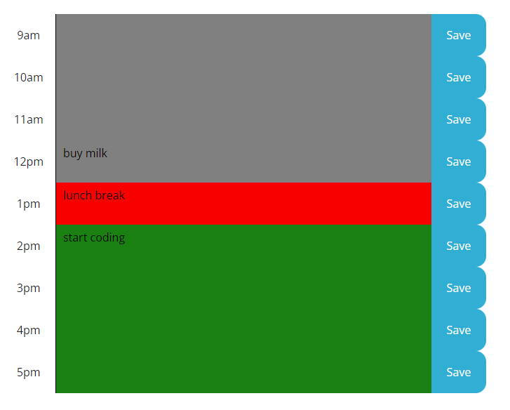

# Work Day Scheduler

## Overview

This a simple calendar application that allows a user to save events for each hour of the day. 

## User Story

```md
AS AN employee with a busy schedule
I WANT to add important events to a daily planner
SO THAT I can manage my time effectively
```

## Journey Map

```md
GIVEN I am using a daily planner to create a schedule
WHEN I open the planner
THEN the current day is displayed at the top of the calendar
```


```md
WHEN I scroll down
THEN I am presented with timeblocks for standard business hours
WHEN I view the timeblocks for that day
THEN each timeblock is color coded to indicate whether it is in the past, present, or future
```


```md
WHEN I click into a timeblock
THEN I can enter an event
```


```md
WHEN I click the save button for that timeblock
THEN the text for that event is saved in local storage
```


```md
WHEN I refresh the page
THEN the saved events persist
```


## Application Link

https://banbanleelee.github.io/PersonalSchedule/
